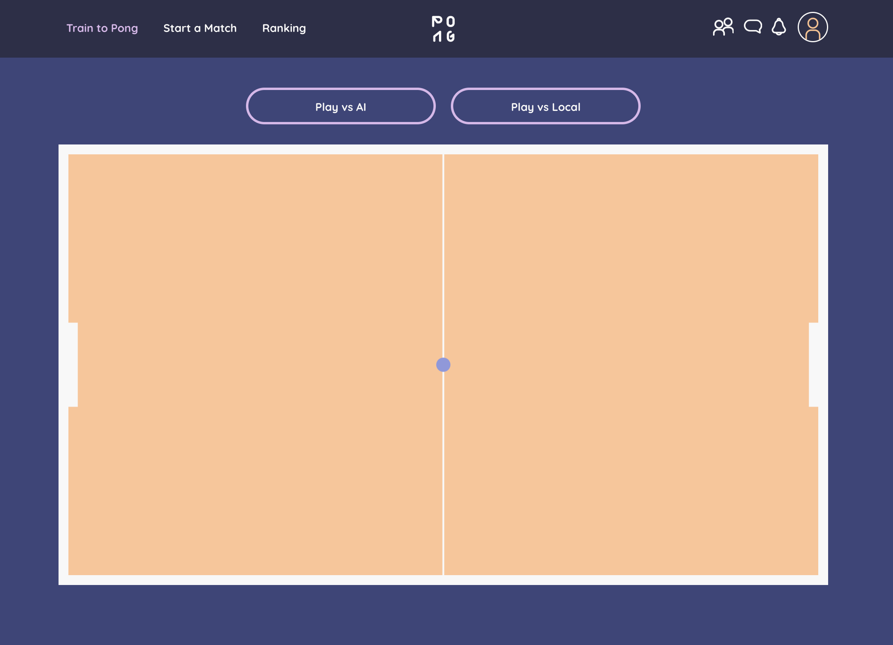

# 🏓 Transcendence  

A **real-time multiplayer Pong platform** built at [42 Lausanne](https://42lausanne.ch).  



Includes **matchmaking, tournaments, live chat**, and an **experimental AI opponent** trained with evolutionary techniques under sparse input constraints.  

📄 **UX/UI & Architecture Diagrams:** [View PDF] https://acrobat.adobe.com/id/urn:aaid:sc:EU:c3863cb2-9cd6-48f1-8df0-6c5ee7b17891


---

## 📌 Overview  

**Team project with Bei, Damian, George, and Eva.**  
- Co-designed the **Domain-Driven + Event-Driven hybrid architecture**.  
- Developed using **TypeScript (frontend)**, **Fastify (backend)**, **Python (AI models)**.  
- Fully **Dockerized** and deployed to **Google Cloud Run** with **Nginx SSL reverse proxy**.  

### My Contributions:  
- **Architecture:** collaborative design sessions.  
- **Server-Side Pong Engine:** ball & paddle physics, scoring, server authority.  
- **WebSockets integration:** real-time loop between backend & frontend.  
- **AI Opponent:** trained with NEAT, experiments with RNN & Deep Q-Learning.  
- **UI/UX:** TypeScript + TailwindCSS.  
- **Deployment:** Docker Compose + Cloud Run + Nginx reverse proxy.  

---

## 🤖 AI Opponent  

- Trained with **NEAT (NeuroEvolution of Augmenting Topologies)**.  
- **Constraint:** AI sees the game state only once per second.  
- Custom methods: **data pruning, early stopping, preventing network bloat**.  
- Trained **hundreds of models** → final network plays consistent, strong Pong.  
- Exported from **Pickle → JSON** → embedded in backend.  
- Parallel experiments with **RNN** and **Deep Q-Learning**.  

---

## ✨ Features  

- ✅ Multiplayer Pong (server-side game loop)  
- ✅ AI opponent with evolutionary training (JSON model)  
- ✅ Matchmaking: invites, AI mode, tournaments  
- ✅ Live chat via WebSockets  
- ✅ User management (auth, nicknames)  
- ✅ Match results stored in SQLite  

---

## 🛠 Tech Stack  

| Layer       | Technology                              |  
|-------------|-----------------------------------------|  
| **Frontend** | Custom framework (TypeScript)           |  
| **Backend**  | Node.js, Fastify, Socket.IO             |  
| **AI**       | Python (NEAT, RNN) → exported JSON      |  
| **Database** | SQLite                                  |  
| **Infra**    | Docker, Nginx, Google Cloud Run         |  
| **Arch**     | Domain-Driven + Event-Driven Hybrid     |  

---

## 🔑 Local Deployment Setup  

1. Clone the repo:  
```bash
git clone https://github.com/whatevacreates/transcendence.git
cd transcendence

2. Add SSL certificates

Inside nginx/ssl, add:

privkey.pem

cert.pem

Generate local dev certs:

cd nginx

mkdir ssl

chmod +x ssl

openssl req -x509 -nodes -days 365 -newkey rsa:2048 \
    -keyout privkey.pem \
    -out cert.pem \
    -subj "/CN=localhost"

3. Add environment file

Contact me → eva.anna.dev@gmail.com
 for .env, then place it in project root.

4. Start Docker

Ensure Docker daemon is running.

5. Run project: 

- make sure that port 8080 is free
make prod-up


This spins up frontend, backend, database, and Nginx proxy.
Accessible at: https://localhost:8443/login

(accept “unsafe” warning for self-signed certs).

🌍 Deployment

Docker images published to Docker Hub.

Google Cloud Run for scalable hosting (frontend + backend).

Nginx reverse proxy for SSL termination.

CI/CD pipeline: GitHub → Cloud Run.

📌 Notes

AI model exported as JSON and embedded into backend at runtime.

Python training code (NEAT, RNN, DQN) lives in a separate repo.

SQLite used locally; Cloud Run deployment DB is ephemeral.

🔥 Built with 42 spirit

Modular, scalable, experimental — and fun.
